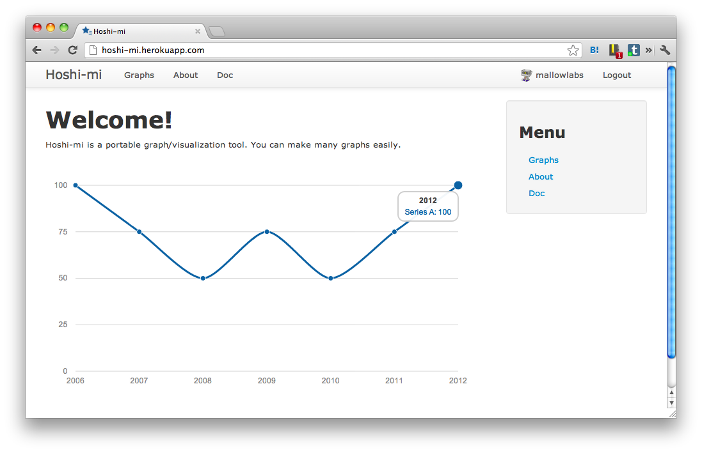
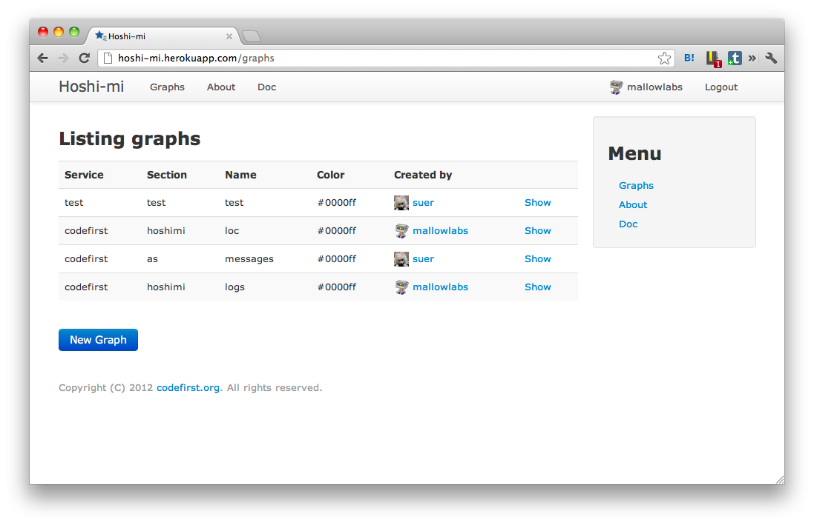
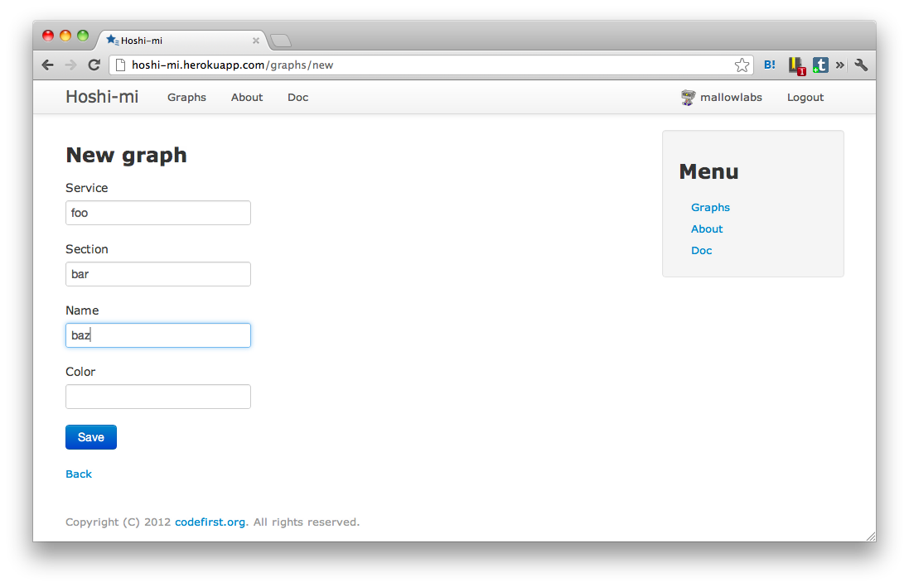
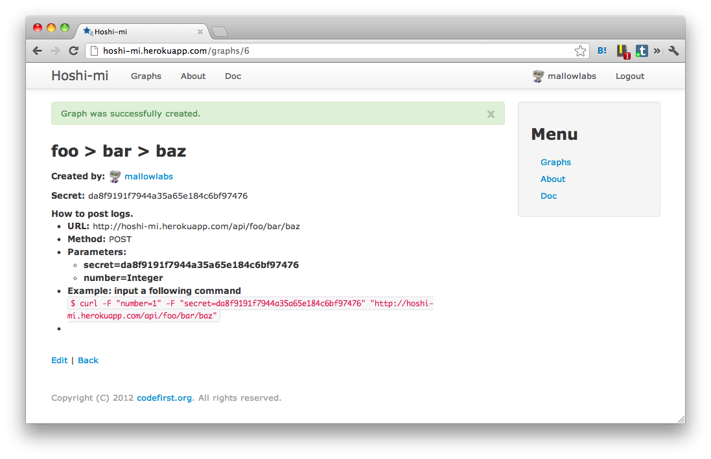
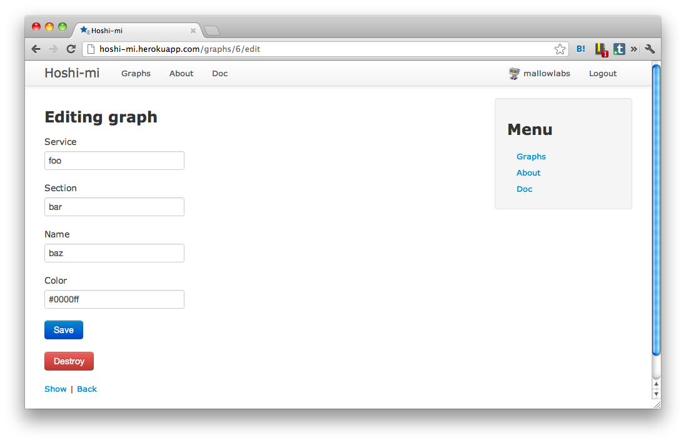

グラフの作り方
==============================

グラフの作成
------------------------

グラフを作成するには以下の手順で行います。

1. Hoshi-mi にログインする
2. Hoshi-mi 上でグラフを作成する
3. データをポストする

Hoshi-mi にログインする
~~~~~~~~~~~~~~~~~~~~~~~

Hoshi-mi へログインするためには、Twitter アカウントが必要です。
トップメニューの **Login** をクリックすると、Twitter のアカウント認証画面に飛びますので
認証をすればログイン完了です。

.. image:: images/top.png
   :width: 640

Hoshi-mi 上でグラフを作成する
~~~~~~~~~~~~~~~~~~~~~~~~~~~~~

ログイン後、トップにある **Graphs** をクリックし、グラフ一覽のページを表示します。

グラフ一覽のページから **New Graph** をクリックします。

必要な情報を埋めて、 **Save** をクリックします。

**Color** は未実装です:P

データをポストする
~~~~~~~~~~~~~~~~~~~~~~~~~~~~

データが何も入っていない状態のグラフは以下のような画面が表示されます。

ここで表示されている **Secret** がグラフにデータを送信するために必要な API キーです。

データの追加には、API の URL にデータを POST することで行います。

* データの追加

  * URL: **/api/[サービス]/[セクション]/[名前]**

  * メソッド: **POST**
  * パラメータ:

    * **secret** (必須)  … グラフの API キーを指定します
    * **number** (必須)  … グラフのデータを整数で指定します
    * **time** (任意)  … グラフのデータの日付を yyyy-MM-dd 形式で指定します(省略時は本日)

curl の例

::

    curl -F "number=1" -F "secret=API_HERE" "http://HOSTNAME/api/service/section/name"

データは、グラフ一個に対して一日に一度しか POST できません。
複数回 POST された場合には、上書きされます。

グラフの編集
----------------------------

グラフの情報を編集する場合は、グラフのページから **Edit** をクリックします。

編集できるのは、

* セクション
* サービス
* 名前
* 色

の4つです。

情報を変更後、 **Save** をクリックします。

**Color** はやっぱり未実装です:P

グラフの削除
----------------------------

グラフの情報を編集する場合は、グラフの編集ページから **Destory** をクリックします。

削除したグラフは、元に戻せないので注意してください。

