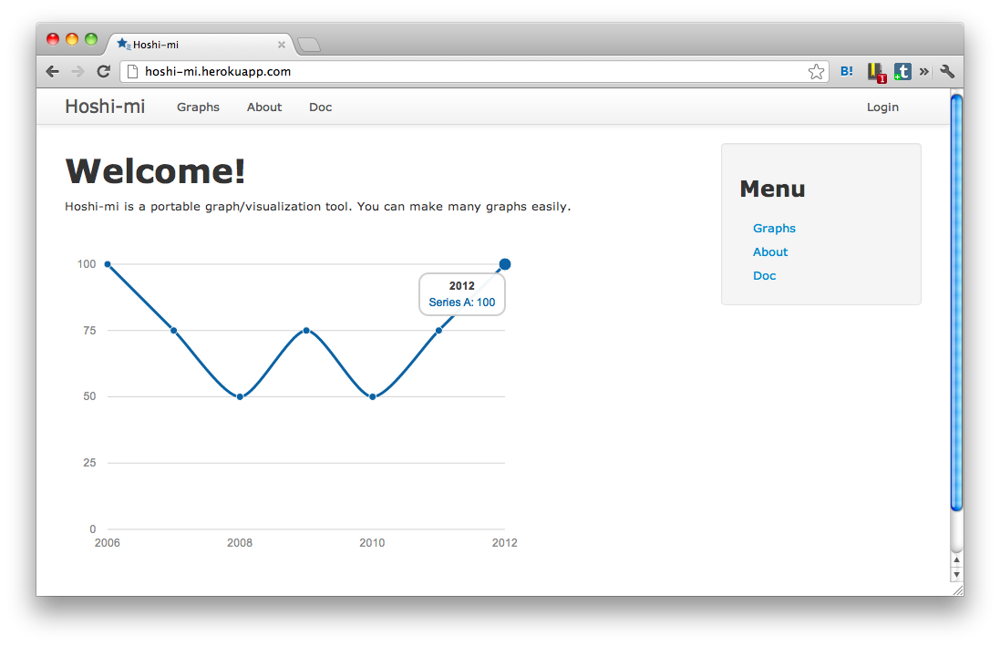

概要
========

Hoshi-mi は、Heroku で動作することを重視した
データビジュアライゼーションツールです。
同様のソフトウェアに GrowthForecast があります。

GrowthForecast とは以下の点で異なる特徴を持ちます。

* グラフ描画に SVG を利用しているため、RRDTool がインストールできない環境でも動作します
* 特に Heroku で動作することを重視しています
* インターネット環境で動作することを想定して作られているため、グラフを作った人だけがグラフにデータを追加することができます

コミッタ
--------

* @mallowlabs
* @suer
* @mzp
